### Hi, I'm Stefan 🖖

Data platform engineer and consultant based in Sydney, Australia 🇦🇺 (by way of Sweden 🇸🇪).

I help organisations design, build and run modern data platforms across the **Microsoft** and **Snowflake** ecosystems, from architecture and governance through to the automation that keeps things running.

### 🔧 What I work on

An ordinary day: drinking some coffee, squashing some bugs, unearthing some awesome code treasures:

  

- ✨ **AI Automation** for workflows and data platforms
- **Microsoft / Azure**: Fabric and cloud-based data platforming
- **Snowflake**: platform engineering, operational tooling
- **Data engineering**: modelling, pipelines, and making platforms maintainable at scale
- **Side projects**: building software products and Android apps

### 🛠️ Tools and tech

`c#` · `ts` · `SQL` · `Python` · `Azure` · `Microsoft Fabric` · `pwsh` · `Kotlin` · `Handlebars`

### 🌱 Right now

Turning a few side projects into real products

- [Agnostic Data Labs](https://agnosticdatalabs.com)
- [Aardflex Android app](https://aardarch.com/aardflex/)
- [Aardink KMP Kotlin code editor](https://aardarch.com/aardink/)
- [Astro-components](https://github.com/sjohansson/astro-components)

### 📫 Get in touch

- LinkedIn: [Stefan Johansson](https://www.linkedin.com/in/johanssonstefan)
- Or open an issue on one of my repos

---
Opinions and code are my own.

<!--
**sjohansson/sjohansson** is a ✨ _special_ ✨ repository because its `README.md` (this file) appears on your GitHub profile.

Here are some ideas to get you started:

- 🔭 I’m currently working on ...
- 🌱 I’m currently learning ...
- 👯 I’m looking to collaborate on ...
- 🤔 I’m looking for help with ...
- 💬 Ask me about ...
- 📫 How to reach me: ...
- 😄 Pronouns: ...
- ⚡ Fun fact: ...
-->
